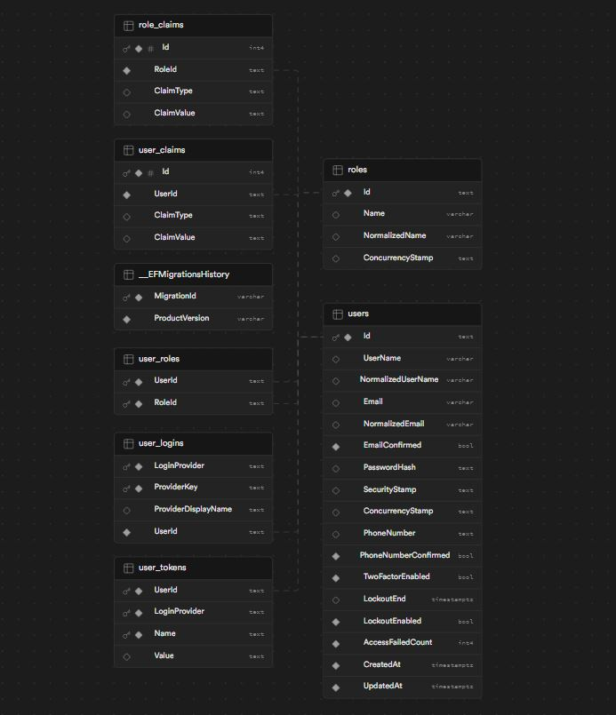

# Ohjelmistokehityksen teknologioita - Seminaarityö

Autentikaatiomikropalvelu

Seminaari: Ohjelmistoarkkitehtuurit ja patternit

Juuso Hakala

8.12.2023

Video: https://video.haaga-helia.fi/media/t/0_kqk38idl

Git-repositorio: https://github.com/hollowdll/auth-microservice

# 1 Johdanto

Seminaarityön tarkoitukseni oli rakentaa autentikaatiomikropalvelu hyödyntäen mikropalveluohjelmistoarkkitehtuuria. Tavoitteeni työn alussa oli saada palvelu Docker-kontiksi ja hyödyntää Dockeria myös kehityksessä. Lisäksi halusin kokeilla kontin julkaisua CSC:n Rahti-palvelun OpenShiftiin, ja harjoitella palvelun käyttöä ja sen ominaisuuksia.

Mikropalveluarkkitehtuurin ideana on jakaa sovellus pienempiin osiin, jolloin se koostuu erillisistä palveluista, jotka kommunikoivat toistensa kanssa tarvittaessa. Jokaista palvelua voidaan kehittää yksilöllisesti, ja käyttöönotto tapahtuu tyypillisesti hyödyntäen konttiteknologioita. (https://fi.wikipedia.org/wiki/Mikropalvelu)

Autentikointiin tarkoitukseni oli käyttää JSON Web Tokenia. Tiesin aiheesta jo hieman, joten ei tarvinnut aloittaa aiheen opiskelua nollasta. Palveluni tuli käyttämään sisäänkirjautumista, joten halusin tehdä pienen sovelluksen, jolla tätä pystyisi testata. Päädyin tekemään CLI-työkalun eli komentoriviohjelman, missä pystyy kirjautumaan sisään ja käyttämään palveluani. En ollut ikinä ennen tehnyt sisäänkirjautumista komentoriviohjelmassa, joten halusin oppia tämän.

Työn vaiheet lyhyesti

1. Mikropalveluprojektin alustus ja GitHub repon luonti
2. Alustavat riippuvuudet ja tietokannan konfigurointi
3. Käyttäjien ja roolien luonti
4. JWT autentikointi
5. REST API ja sisäänkirjautuminen
6. gRPC palvelut
7. Docker
8. CLI:n luonti
9. Käyttäjien hakeminen
10. Palvelun julkaisu OpenShiftiin

Katso myös projektin README.md [täältä](../README.md)

# 2 Käytetyt tekniikat

## 2.1 Mikropalvelun tekniikat

Rakensin mikropalveluni C#-ohjelmointikielellä ja .NET frameworkin ASP.NET Corella. ASP.NET Core on avoimen lähdekoodin framework, millä voi rakentaa moderneja webbisovelluksia. Se soveltuu etenkin pilviympäristöissä suoritettaviin ohjelmistoihin. (https://github.com/dotnet/aspnetcore).

Käytin .NET frameworkin versiota 6. Lisäksi hyödynsin .NET frameworkin CLI työkaluja, jotka helpottivat omaa työstämistäni.

Projektin loin valmiilla pohjalla, jota lähdin muokkaamaan. Sen sai komennolla

```bash
dotnet new webapi
```

### 2.1.1 Tietokanta

Tietokantana käytin PostgreSQL:ää. Mikropalvelussa käytin .NET frameworkin Entity Frameworkia relaatiotietokannan hallinnoimiseen (https://learn.microsoft.com/en-us/aspnet/entity-framework). Se on ORM eli object-relational mapper, millä voi luoda tietokantatauluja suoraan C#-koodista. Tämä työkalu oli minulle tuttu jo entuudestaan, ja itselleni se antoi hyvän kehittäjäkokemuksen.

Tietokannan scheman sai generoitua komennolla

```bash
dotnet ef migrations add UserDatabase
```

Se generoi C#-kooditiedoston, jolla pystyy luomaan tietokannan. Mikropalveluni konfiguroin, että se luo tietokannan käynnistäessä, jos sitä ei ole.

#### 2.1.1.1 Tietokannan schema

Alla kuva tietokannan rakenteesta. Käyttämäni [Identity framework](#212-käyttäjät) luo valmiiksi paljon tauluja, mitä en tarvinnut ollenkaan. Projektissa käytin ainoastaan tauluja users, user_roles, ja roles.



### 2.1.2 Käyttäjät

Käyttäjien luontiin ja hallinnoimiseen käytin .NET frameworkin Identity järjestelmää (https://learn.microsoft.com/en-us/aspnet/core/security/authentication/identity?view=aspnetcore-8.0&tabs=visual-studio). Sillä saa helposti tuotantovalmiin pohjan käyttäjätietojen hallinoimiseen, mitä voi tarvittaessa laajentaa ja muokata. Tietokantatauluja ei tällä tarvitse luoda käyttäjille, koska ne saa generoitua valmiiksi. Muutin kuitenkin valmiit tietokantataulujen nimet.

Käyttäjille lisäsin `created_at` ja `updated_at` kentät. Tämän sai laajentamalla C#-luokkaa `IdentityUser` luomalla oman käyttäjä-luokan.

```C#
public class AppUser : IdentityUser
{
    public AppUser()
    {
        CreatedAt = DateTime.UtcNow;
        UpdatedAt = DateTime.UtcNow;
    }

    public AppUser(string username)
    {
        UserName = username;
        CreatedAt = DateTime.UtcNow;
        UpdatedAt = DateTime.UtcNow;
    }

    /// <summary>UTC timestamp when the user is created.</summary>
    public DateTime CreatedAt { get; set; }
    /// <summary>UTC timestamp when the user is updated.</summary>
    public DateTime UpdatedAt { get; set; }
}
```

### 2.1.3 Autentikaatio

Autentikaatioon käytin JSON Web Tokenia. Kun käyttäjä pyytää jotain resurssia palvelusta, pyynnön mukana pitää tulla JWT access token. Palvelu tarkistaa, että token on kelvollinen ja voimassa. Token pitää sisällään käyttäjän tietoja kuten käyttäjänimen ja roolit. (https://en.wikipedia.org/wiki/JSON_Web_Token).

Sisäänkirjautumisen yhteydessä palvelu palauttaa aina uuden JWT access tokenin, jolla käyttäjä voi autentikoitua palveluun. Tokenit ovat voimassa vain lyhyen ajan tietoturvan vahvistamiseksi. 

### 2.1.4 REST API

Palvelussa on REST API, missä on kaksi endpointia. Toinen on sisäänkirjautumiseen ja toinen käyttäjien hakemiseen. Käyttäjien hakeminen vaatii autentikaation ja admin-roolin. Katso [REST API endpointit](../README.md#rest-api)

REST API pyörii palvelun portissa 5105, missä on käytössä HTTP/1.1.

### 2.1.5 gRPC

REST API:n lisäksi palvelussani on myös toisenlainen API. Käytin tähän gRPC Remote Procedure Call frameworkia (https://en.wikipedia.org/wiki/GRPC). gRPC käyttää HTTP protokollan versiota HTTP/2. Tiedonsiirrossa on käytössä Protocol Buffers -dataformaattia (https://en.wikipedia.org/wiki/Protocol_Buffers).

gRPC on REST API:a nopeampi tiedonsiirrossa yleensä suuremmilla tietomäärillä. Minun projektissa nopeuksilla ei ollut melkein mitään eroa, koska tietomäärät olivat hyvin pienet. gRPC on kuitenkin tänä päivänä suosittu ja käytetty etenkin mikropalveluiden maailmassa, joten halusin kokeilla sitä.

gRPC palvelut pyörivät portissa 5106, ja pitävät sisällään myös sisäänkirjautumisen ja käyttäjien hakemisen.

#### 2.1.5.1 Protocol Buffers

Ideana on määritellä ensin .proto tiedostoon tietotyypit, servicet, ja RPC:t. Tämän jälkeen .proto tiedostosta voi generoida jollekkin ohjelmointikielelle koodia, mitä voi kutsua. Käytin seuraavaa dokumentaatiota kun aloitin: https://learn.microsoft.com/en-us/aspnet/core/grpc/basics?view=aspnetcore-8.0.

Tässä esimerkki yksinkertaisesta RPC:stä
```
service Login {
    rpc LoginUser (LoginRequest) returns (LoginResponse) {}
}
```

.proto tiedostot löytyvät [täältä](../src/AuthService/Proto/)

### 2.1.6 Docker

Dockeria hyödynsin sekä kehityksessä, että julkaisussa. Tein Dockerfilen, millä sain tehtyä mikropalvelustani Docker imagen. Tästä imagesta sai ajettua kontteja. Palveluni käytti kuitenkin tietokantaa, joten hyödynsin Docker Composea paikallisesti, jolla sain ajettua palveluni ja tietokannan yhdessä. Määrittelin tarvittavat asiat docker-compose.yml tiedostoon, missä määrittelin tietokannan omaan konttiin. Näin sain tehokkaasti testattua kokonaisuutta omalla koneellani.

Imagen luonti
```bash
docker build -t auth-microservice .
```

Palvelun ja tietokannan ajo Docker Composella
```bash
docker compose up -d
```

### 2.1.7 Health checkit

Tein palveluuni myös pienen sisäänrakennetun health checkin. Mikropalveluissa on tapana olla health checkeja, joilla voidaan varmistaa palvelun tila, että kaikki on kunnossa. Katso [Health check](../README.md#health-checks)

Tässä esimerkki tilasta, missä palvelu ja tietokanta ovat OK.

```json
{
  "status": "Healthy",
  "results": {
    "PostgreSQL": {
      "status": "Healthy",
      "description": null,
      "data": {}
    }
  }
}
```

### 2.1.8 Salasanat

Salasanat eivät jää tietokantaan selkokielisiksi, vaan käytin BCrypt algoritmia, mikä on valmiina .NET identityssä. Tämän lisäksi käytin pepperiä salasanojen suojauksessa (https://en.wikipedia.org/wiki/Pepper_(cryptography)). Pepper on salainen arvo, mikä lisätään salasanaan, ennen kuin se syötetään BCryptille. Tämän jälkeen yhdistelmään lisätään salt-luku ja sitten hashataan.

## 2.2 CLI:n tekniikat

Komentoriviohjelman rakensin Rust-ohjelmointikielellä. Rust on avoimen lähdekoodin moderni järjestelmäohjelmointikieli, millä saa tehtyä esimerkiksi tehokkaita ja suorituskykyisiä komentoriviohjelmia. (https://www.rust-lang.org/)

Riippuvuudet määritellään Cargo.toml tiedostoon ja Rustin cargo-työkalulla saa buildattua projektin

```bash
cargo build
```

Kun CLI:ssä kirjautuu sisään ja saa mikropalvelulta JWT access tokenin, ohjelma tallentaa sen tiedostoon samaan hakemistoon, missä ohjelma on. Kun tekee komentoja, jotka lähettää verkkopyyntöjä, ohjelma lukee JWT:n tiedostosta ja sisällyttää sen pyyntöön.

### 2.2.1 clap

Ohjelman pohjana käytin clap-nimistä kirjastoa (https://docs.rs/clap/latest/clap/). Sillä saa helposti tehtyä komentoriviohjelmia, mihin tulee valmiina laajennettavia komentoja ja ominaisuuksia.

### 2.2.2 tokio

Verkkopyyntöihin tarvitsin asynkronisen ajonajan, mihin käytin tokiota (https://github.com/tokio-rs/tokio). Tämän avulla pystyin käyttämään Rust-koodissani futureita eli async-await syntaksia. Rustin futuret ovat idealtaan samankaltaisia kuin JavaScriptin promiset.

### 2.2.3 tonic

gRPC pyyntöjen tekemiseksi mikropalveluuni tarvitsin gRPC clientin. Käytin tähän Rustin tonic-kirjastoa (https://github.com/hyperium/tonic). Pystyin generoimaan Rust-koodia mikropalveluuni tekemistäni .proto tiedostoista, ja näillä pystyin helposti tekemään gRPC clientin ohjelmaani.

### 2.2.3.1 Protobuf

Toisin kuin C# puolella, Rustin puolella tarvitsi Protocol Buffersin Protobuf-kääntäjän, jotta .proto tiedostot pystyi kääntämään Rust-koodiksi. C# puolella tämä tulee valmiina gRPC-riippuvuuden mukana. Tämä oli itselleni paras paikka ladata protobuf-kääntäjä: https://github.com/protocolbuffers/protobuf#protobuf-compiler-installation

### 2.2.4 reqwest

HTTP pyyntöjen tekemiseen REST API:in tarvitsin http clientin. Käytin tähän reqwest-kirjastoa, jolla sain samaan tapaan tehtyä HTTP clientin ohjelmaani. Tällä pystyin lähettämään verkkopyyntöjä mikropalveluuni.

# 3 CLI:n toiminnot

## 3.1 Alustus

Optimoidun julkaisuversion CLI:stä saa buildattua komennolla

```bash
cargo build --release
```

Tämän jälkeen pitää asettaa kaksi ympäristömuuttujaa samassa shell-prosessissa, missä ajaa ohjelman. Käytin PowerShelliä Windows Terminaalilla, joten ympäristömuuttujien asettaminen on hieman erilainen kuin esimerkiksi Linux-pohjaisessa bashissa.

Lokaalisti pyörivä mikropalvelu, jonka saa Docker Composella käyntiin
```PowerShell
$env:REST_API_URL="http://localhost:5105/api/v1"
```
```PowerShell
$env:GRPC_API_URL="http://localhost:5106"
```

Rahti-palvelun OpenShiftiin julkaistu mikropalvelu
```PowerShell
$env:REST_API_URL="http://auth-microservice-http1.rahtiapp.fi/api/v1"
```
```PowerShell
$env:GRPC_API_URL="http://auth-microservice-http2.rahtiapp.fi"
```

gRPC vaati HTTP/2 toimiakseen. Pitkän ongelmanratkaisun jälkeen sain selville, että Rahti-palvelun OpenShift versio ei tue HTTP/2, joten gRPC:tä en saanut toimimaan siellä. REST API ja health check endpoint kuitenkin toimivat siellä.

## 3.2 Sisäänkirjautuminen

Tässä esimerkki sisäänkirjautumisesta Rahdissa pyörivään palveluun käyttäen REST API:a.


Tietoturvan parantamiseksi salasana ei näy kun sitä kirjoittaa. Tämän sai tehtyä helposti yhdellä Rustin kirjastolla (https://github.com/conradkleinespel/rpassword).

Tässä vielä koodiesimerkki salasanan lukemisesta

```Rust
let password = match rpassword::prompt_password("Password: ") {
    Ok(password) => password,
    Err(e) => return eprintln!("Failed to read password: {}", e),
};
```

## 3.3 Käyttäjät

Tässä esimerkki käyttäjien listaamisesta. Olen kirjautuneena admin-käyttäjänä.


Katso kaikki komennot [Tästä](../README.md#cli)

# 4 Arkkitehtuurikaavio

Alla oleva kaavio havainnolistaa mikropalvelun rakennetta ja JWT autentikaation kulkua. Palvelussani on ainoastaan JWT access tokenit, eikä refresh tokeneja ole.

Sisäänkirjautuminen on sekä gRPC palveluissa, että REST API:ssa.

Kaavio piirretty [Excalidraw:lla](https://excalidraw.com/)


# 5 OpenShift

Kirjautuminen Rahdin konttirekisteriin. Käytin PowerShelliä.
```
get-content dockerlogin | docker login -u unused --password-stdin docker-registry.rahti.csc.fi
```
Laitoin salasanan tiedostoon "dockerlogin". Yllä oleva komento lukee salasanan tiedostosta ja siirtää sen "docker login" komennolle --password-stdin:n avulla. Tämä on Dockerin suosittelema tapa ja tietoturvallisempi, koska salasana ei jää lokeihin ja komentohistoriaan. Tämä Stackoverflow-keskustelu oli apuna: https://stackoverflow.com/questions/51489359/docker-using-password-via-the-cli-is-insecure-use-password-stdin

Tällä komennolla loin imagen mikropalvelustani.
```
docker build -t auth-microservice .
```

Tällä komennolla tein imagelle tägin ennen puskemista Rahdin konttirekisteriin
```
docker tag auth-microservice docker-registry.rahti.csc.fi/ohke-teknologiat-seminaari/auth-microservice:rahti
```

Tällä komennolla puskin imagen Rahdin konttirekisteriin omaan image streamiini.
```
docker push docker-registry.rahti.csc.fi/ohke-teknologiat-seminaari/auth-microservice:rahti
```

Tämän jälkeen pystyin deployaamaan palvelun image streamista.

# 6 Tulokset

## 6.1 Toimivuus
Kaikkein tärkein tulos oli, että sain mikropalvelun rakennettua. Sain sen päätoiminnallisuuden toimintakuntoiseksi ja Dockerilla kontiksi. JWT autentikaatio ja sisäänkirjautuminen toimi sekä REST API:lla, että gRPC:llä. Lisäksi käyttäjien roolit sain toimimaan kuin halusin. Kun palvelu generoi JWT tokenin, se kirjoittaa tokeniin käyttäjän roolit. Näin palvelu pystyy katsomaan, onko käyttäjällä tarvittava rooli johonkin toimenpiteeseen, kun pyynnön mukana tulee JWT.

## 6.2 Ominaisuudet
Ominaisuuksia palveluun ei ehtinyt kertyä kauheasti, mutta siitä on hyvä jatkaa, jos haluan jatkokehittää projektia. Suurimmat toiminnallisuudet palvelulla on sisäänkirjautuminen ja käyttäjien hakeminen tietokannasta. Palvelun sisällä on toki paljon asioita mitä tein, mutta ne eivät näy ulospäin.

## 6.3 Docker
Docker Composella sain palvelun pyörimään ongelmitta omalla koneellani PostgreSQL:n kera. Tein myös toisen docker-compose.yml tiedoston, jolla saa suoritettua pelkästään PostgreSQL:n. Tällä pystyin helpommin kehittämään palvelua, kun ajoin C#-projektia omalla koneellani, enkä Docker-kontissa.

## 6.4 Ohjelmointikielen valinta
Ihan alkuperäinen ajatus minulla oli rakentaa palvelu Go-ohjelmointikielellä. Go-kieltä olen halunnut oppia jo pitkään ja se on todella suosittu mikropalveluiden keskuudessa. Aikaa ei kuitenkaan ollut niin paljon, niin päädyin käyttämään C#-kieltä, koska se oli minulle entuudestaan tuttu. Opin kuitenkin mikropalveluista paljon uutta, mistä en aluksi ollut edes tietoinen.

Rustin valitsin CLI:n rakentamiseen, koska sitä osasin valmiiksi, ja se oli hyvä valinta kyseisen ohjelmiston tekemiseen. Rust on haastava kieli, mutta omia lempikieliäni. Omasta mielestäni se jos joku opettaa ohjelmoinnista paljon. Itse olen oppinut Rustista paljon ohjelmointikonsepteja, mitä esimerkiksi Python tai JavaScript eivät ole opettaneet minulle. Suosittelen kokeilemaan, jos haluaa kunnon hakkerifiiliksen kun koodaa!

## 6.5 EF, Identity, JWT
Entity Framework ja Identity, mitä käytin tietokantaan ja käyttäjien hallintaan, olivat minulle myös hieman tuttuja. JWT autentikaatiota en kuitenkaan ollut ennen tehnyt näiden kanssa, joten siitä tuli uusi yhdistelmä. ASP.NET Coressa on sisäänrakennettuna cookie-autentikaatio, joten JWT oli hieman työläämpi, koska se piti itse konfiguroida ja koodata.

JWT autentikaation rakensin vain access tokenit, jotka vanhenee 30 minuutissa. Hieman tuotantovalmiimmassa JWT:ssä on mukana myös refresh tokenit, mitä olisin ehkä kokeillut, jos aikaa olisi ollut enemmän.

## 6.6 gRPC
gRPC oli minulle uutta. Olin siitä lukenut paljon aikaisemmin, mutta en ikinä kunnolla toteuttanut gRPC palvelua. Protocol Buffers, mitä gRPC käyttää oli minulle toki tuttu, koska käytän sitä yhdessä omassa projektissani. En ala tässä mainostamaan siitä, mutta jos kiinnostaa, niin olen käyttänyt sitä omassa tietokantamoottorissani (https://github.com/hollowdll/database-system). Kyseinen projekti on vielä kehitysvaiheessa.

gRPC oli haastava, mutta opettava. Opettelin vain pintaraapaisun aiheesta, ja siitä olisi saanut vielä paljon enemmän irti. Hyvä puoli siinä on, että se ei ole lukittu mihinkään tiettyyn ohjelmointikieleen tai teknologiaan.

## 6.7 CLI
CLI-työkalun rakentaminen oli hauska ja opettavainen kokemus. Olen pari vastaavanlaista pientä CLI:tä koodaillut Rustilla, mutta tässä oli hieman uutta, kuten gRPC client, JWT tokenin tallennus, ja sisäänkirjautuminen palvelimelle.

JWT tokenin tallennus ei ollut ehkä kaikkein paras. Se tuli tallennettua tiedostoon selkokielisenä. Olisin halunnut kokeilla salata sen, mutta tähän ei aika riittänyt ja olisi varmaan mennyt vähän haastavaksi.

## 6.8 OpenShift
OpenShiftissä palvelun sain toimimaan vain puoliksi. Se ei tukenut HTTP/2, mitä gRPC käyttää, joten gRPC:tä en saanut siellä toimimaan. OpenShiftin toiminnallisuuksista ja konttien julkaisusta opin uutta. Se oli hyvä alusta aloittaa aiheen harjoittelu ja opiskelu, ja luulen että tulen hyötymään jatkossa oppimistani asioista.

PostgreSQL-tietokantaa en OpenShiftiin pistänyt, koska versio mitä sinne saa ei toiminut palveluni kanssa. Tein Supabase-nimiseen palveluun PostgreSQL-tietokannan ja deployattu palvelu käytti sitä (https://github.com/supabase/supabase). Connection stringiä sai muutettua helposti muuttamalla ympäristömuuttujaa secretin kautta.

Kauhean syvällisesti en ehtinyt asioita siellä opiskella, mutta muutaman aiheen opin paremmin, kuten image/konttirekisterin, imagen deployaus, image stream, podit, routet, ja secretit. Suunnittelen opiskelevani aiheesta lisää itsenäisesti kurssin jälkeen.

# 7 Lopetus

Kiitos lukemisesta!

Työstäni tuli paljon laajempi kuin aluksi suunnittelin. Siihen upposi huomattavasti enemmän aikaa, kuin ehdotettu 20 tuntia. Lisäksi jouduin ottamaan yli viikon tauon armeijan kertausharjoituksen takia.

Opin paljon uutta ja olen tyytyväinen omaan lopputulokseeni.

Linkki videoon: https://video.haaga-helia.fi/media/t/0_kqk38idl

[Takaisin ylös](#ohjelmistokehityksen-teknologioita---seminaarityö)
